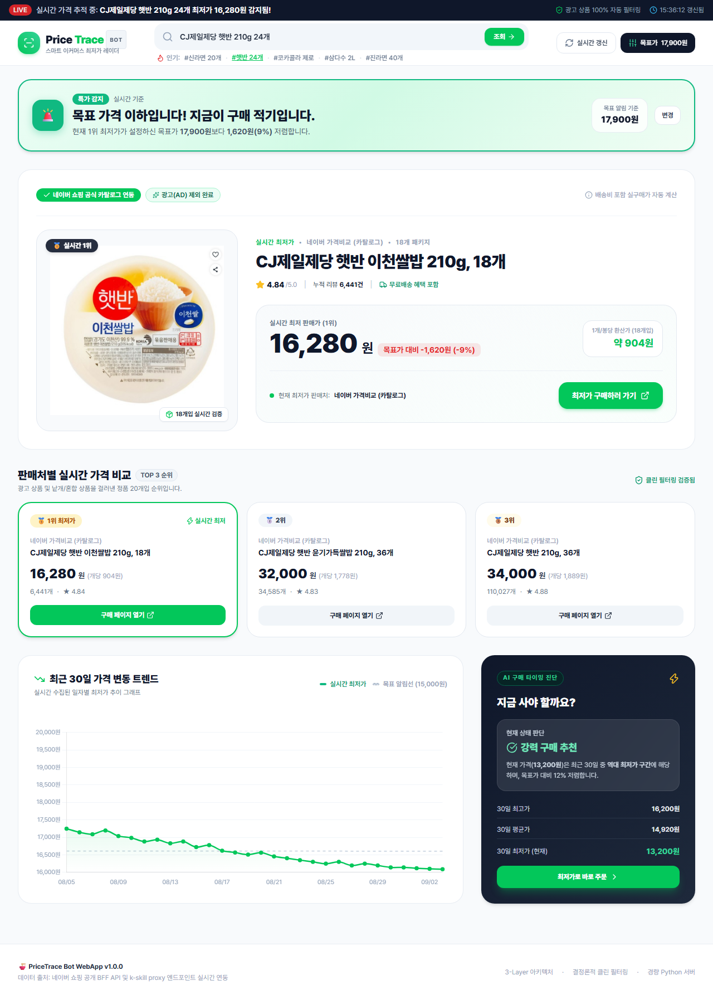

# 🍜 PriceTrace WebApp | 네이버 쇼핑 전 품목 실시간 최저가 레이더

네이버 쇼핑 및 국내 주요 이커머스(쿠팡, 지마켓 등)의 가격비교 UX를 반영하여, **생필품, 가전, 디지털, 패션 등 모든 상품의 실시간 최저가 검색, 실제 상품 이미지 자동 렌더링, 패키지 단위 단가 자동 계산, 목표가 알림, 30일 가격 추이 차트**를 제공하는 경량 반응형 웹앱입니다.



---

## 🌟 주요 기능

1. **전 품목 실시간 최저가 자동 감지**: 신라면, 햇반, 음료, 생수뿐만 아니라 커피, 세제, 가전, 디지털 등 네이버 쇼핑 전체 상품 실시간 크롤링
2. **16대 인기 생필품 동적 셔플 & 30초 자동 로테이션**: 접속할 때마다 라면, 즉석밥, 탄산음료, 커피, 롤화장지, 세제 등 국민 생필품 추천 태그 칩과 카드가 동적으로 셔플 및 로테이션
3. **네이버 n2 오류 및 로그인·캡차 방지 정규화 엔진**:
   - 카탈로그 상품: 외부 유입 시 네이버 로그인(`nidlogin`) 창을 원천 우회하는 네이버 쇼핑 오픈 검색 딥링크 자동 변환
   - 스마트스토어 상품: 영수증 보안문자(CAPTCHA) 발생을 최소화하는 모바일 반응형 URL 매핑 및 레퍼러 헤더 정상화
4. **동적 고화질 이미지 연동**: 네이버 쇼핑 공식 이미지 서버(CDN)와 직결하여 검색된 실제 상품 사진 자동 노출
5. **클린 필터링 & 정렬**: 스폰서 광고(AD) 상품 및 비정상 가격 자동 배제, 진짜 최저가 오름차순 정렬
6. **패키지 수량 감지 & 1개당 환산가 자동 계산**: 상품명에서 수량(24개, 18개, 6병 등)을 자동 감지하여 1개당 환산 단가 실시간 계산
7. **스마트 목표가 & 특가 알림**: 상품 가격대에 맞춘 목표가 자동 설정 및 `🚨 [특가 감지]` 뱃지/할인율 산출
8. **최근 30일 가격 변동 트렌드 차트**: 실시간 최저가 기준 시세 트렌드 시각화 및 구매 적기 진단
9. **Vercel 원클릭 배포 완벽 지원**: Serverless Function (`api/index.py`) 및 `vercel.json` 내장으로 무료 호스팅

---

## 🚀 초보자를 위한 깃허브(GitHub) 및 Vercel 배포 가이드

아래 순서대로 따라 하시면 3분 안에 내 웹앱이 인터넷 주소(`https://...vercel.app`)로 배포됩니다!

### [1단계] GitHub에 코드 올리기

1. **[GitHub](https://github.com/)**에 로그인 후 우측 상단의 **[+] → [New repository]**를 클릭합니다.
2. `Repository name`에 `pricetrace-webapp` (원하는 이름)을 입력하고 **[Create repository]** 버튼을 누릅니다.
3. 내 컴퓨터의 터미널(PowerShell 또는 CMD)에서 이 프로젝트 폴더로 이동한 뒤 아래 4개 명령어를 차례대로 입력합니다:

```bash
git init
git add .
git commit -m "feat: 네이버 쇼핑 최저가 비교 웹앱 초기 구축"
git branch -M main
git remote add origin https://github.com/Jangwoojin73/pricetrace.git
git push -u origin main
```

---

### [2단계] Vercel에서 원클릭 무료 배포하기

1. **[Vercel 공식 사이트](https://vercel.com/)**에 접속하여 **[Sign Up]** (GitHub 계정으로 로그인)합니다.
2. 대시보드에서 **[Add New...] → [Project]**를 클릭합니다.
3. 방금 올린 GitHub 레포지토리(`pricetrace`) 옆의 **[Import]** 버튼을 누릅니다.
4. **별도 설정 변경 없이 바로 하단의 [Deploy] 버튼을 클릭합니다.**
   - `vercel.json`과 `api/index.py`가 이미 완벽하게 설정되어 있어 자동으로 빌드 및 배포됩니다.
5. 약 1분 후 폭죽 애니메이션과 함께 **`https://내프로젝트.vercel.app` 형태의 나만의 고유 웹사이트 주소**가 생성됩니다! 🎉

---

## 💻 내 컴퓨터(로컬)에서 실행하는 법

추가 설치 프로그램(`pip`나 `npm`) 없이 파이썬만 있으면 바로 실행됩니다:

```bash
# 로컬 웹 서버 실행 (포트 8080)
python server.py --port 8080

# 브라우저 접속
http://localhost:8080
```

---

## 📁 프로젝트 파일 구조

```
pricetrace-bot/
├── vercel.json                 # Vercel 서버리스 및 정적 파일 라우팅 설정
├── requirements.txt            # Vercel 파이썬 환경 설정
├── .gitignore                  # 깃 버전 관리 제외 파일 목록
├── server.py                   # 로컬 실행용 경량 웹 서버
├── pricetrace_bot.py           # 네이버 쇼핑 최저가 크롤링 및 정제 핵심 로직
├── api/
│   └── index.py                # Vercel Serverless Function 진입점
├── public/
│   ├── index.html              # 이커머스 전형적 스타일 메인 화면
│   ├── style.css               # 테마 및 애니메이션
│   └── app.js                  # 실시간 데이터 통신 & Chart.js 렌더링
└── docs/                       # 기획(PRD) 및 설계(TRD), 분석(GAP) 문서
```

---

## 📄 라이선스
MIT License
